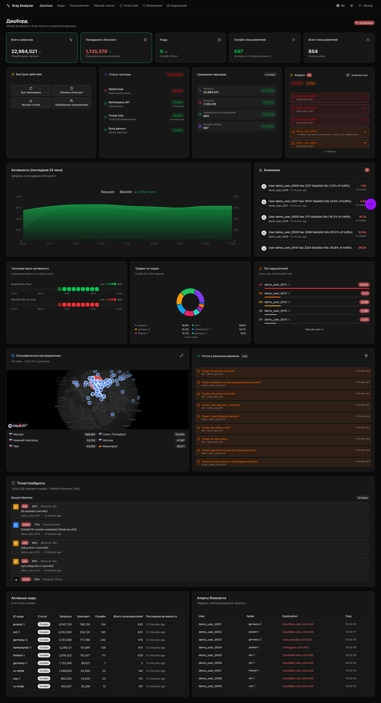
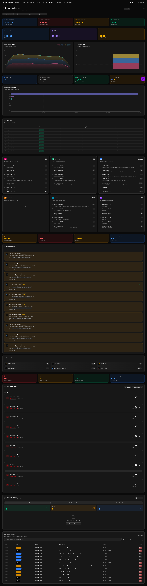
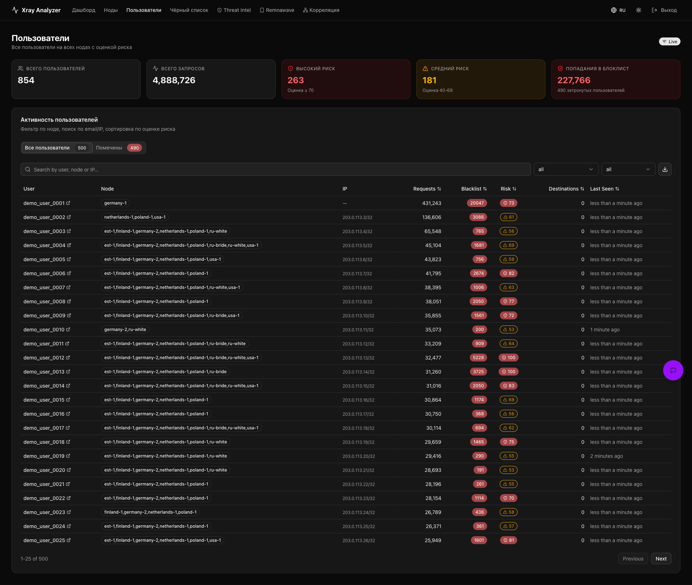
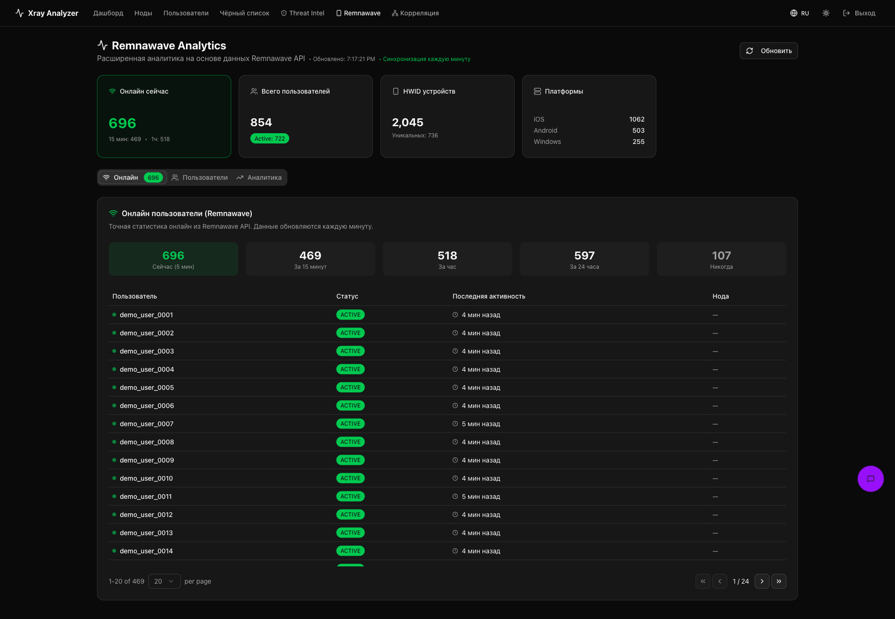
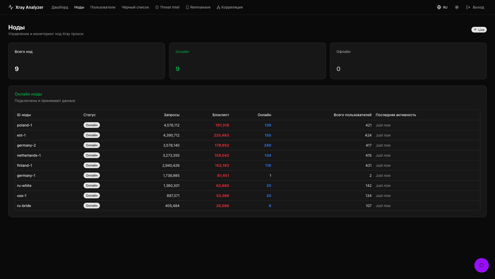
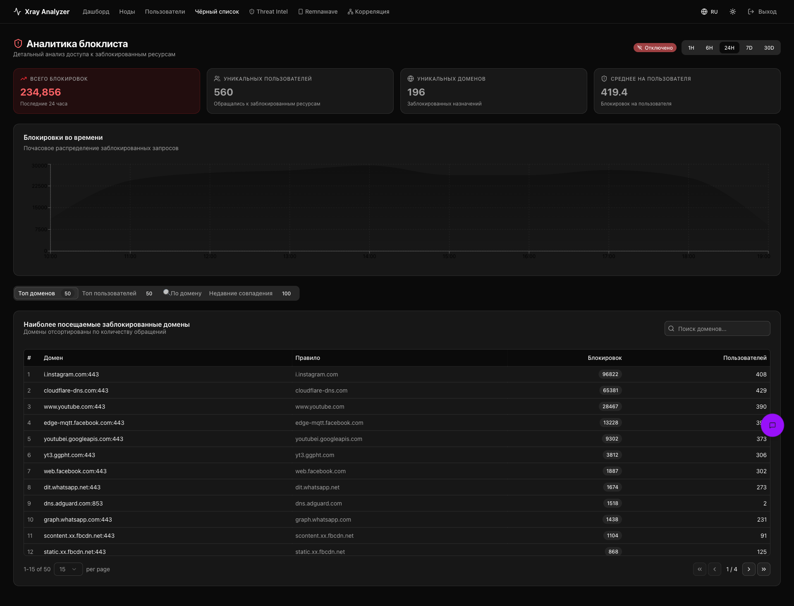

<div align="center">

# Xray Log Analyzer

**Real-time аналитика access-логов Xray с интеграцией Remnawave**

Собирает access-логи со всех VPN-нод через лёгких агентов, агрегирует в Postgres с daily-партиционированием, детектит abuse/threat-трафик по 1.5M+ индикаторам, синхронизирует пользователей с панелью Remnawave и показывает всё это в дашборде на Next.js в стиле Liquid Glass.

[Возможности](#-возможности) · [Скриншоты](#-скриншоты) · [Архитектура](#-архитектура) · [Быстрая установка](#-быстрая-установка) · [Конфигурация](#-конфигурация) · [FAQ](#-faq-и-troubleshooting)

</div>

> Изначально создан на базе [qwertyhq/xray-analyzer](https://github.com/qwertyhq/xray-analyzer), с тех пор существенно переработан и расширен в этом репозитории.

---

## Зачем это нужно

Если у вас несколько VPN-нод под Remnawave (Xray-core), стандартная картина такая: логи разбросаны по серверам, узнать «кто и куда ходит» можно только руками через `grep` по каждой ноде, а Remnawave-панель показывает *кто подключён*, но не *что происходит в трафике*.

Этот проект закрывает разрыв между «панель управления подписками» и «что реально происходит на нодах»:

- Логи стекаются в одно место в реальном времени — не нужно заходить на 20 серверов
- Каждый запрос сверяется с базой threat-индикаторов (малварь, фишинг, ботнеты, трекеры, пиратство, казино и т.д.) — вы видите, кто из пользователей делает что-то подозрительное, а не только «сколько трафика съел»
- Bridge-топологии (RU-нода → фронтирует → EU-exit) корректно разрешаются обратно к реальному пользователю, а не теряются на промежуточном хопе
- Пользователи Remnawave синхронизируются автоматически — вместо синтетических ID в интерфейсе видны настоящие юзернеймы, HWID-устройства, статус подписки
- Алерты летят в Telegram с троттлингом скорости отправки (Telegram банит за флуд — это учтено)
- Всё это доступно из веб-интерфейса на русском, без необходимости лезть в SQL или логи вручную

---

## 📸 Скриншоты

> Все usernames / UUID / IP на скриншотах замаскированы — это demo-данные, не продовые. Скриншоты сняты до перехода интерфейса на текущий стиль Liquid Glass (стеклянные поверхности, единая цветовая логика, компактные плитки показателей) — структура функций та же, визуальный слой с тех пор заметно чище.

### Дашборд
Живые метрики, статус подсистем (WebSocket / Remnawave / Threat Intel / БД), аномалии, гео-карта подключений, лента событий в реальном времени, активные ноды, алерты блоклиста.



### Threat Intelligence
1.5M+ индикаторов (реклама, малварь, казино, Tor, фишинг, пиратство и др.), разбивка по категориям, недавние совпадения, топ стран, риск-профили пользователей, конструктор отчётов.



### Пользователи
Все пользователи со всех нод с расчётным risk-score, поиском по email/IP, фильтрами по риску и ноде, детальная карточка на каждого — угрозы, посещённые домены, блоклист-совпадения, алерты, история IP.



### Remnawave
Расширенная аналитика поверх Remnawave API: онлайн сейчас / 15 мин / 1ч / 24ч, HWID-устройства, разбивка по платформам, трафик, статусы подписок.



### Ноды
Мониторинг всех VPN-нод: статус подключения, запросы, блоклист-хиты, онлайн-пользователи. Мастер добавления новой ноды генерирует готовую команду установки агента.



### Чёрный список
Детальная аналитика блокировок: топ доменов, топ пользователей, почасовой график, поиск и фильтры.



---

## ✨ Возможности

### Сбор данных

| Функция | Описание |
|---|---|
| **Real-time ingest** | Лёгкий агент на каждой ноде читает `access.log` через `inotify` (не polling — реагирует мгновенно на новые строки), батчит по 1000 записей / 5 секунд, сжимает gzip и стримит на сервер по WebSocket |
| **Postgres с daily-партиционированием** | Горячие таблицы (`request_events`, `bridged_flows`, `alerts`, `threat_matches`, `blacklist_matches`, `anomalies`) партиционируются по дням. Истёкшие партиции дропаются целиком — ноль VACUUM-мусора, в отличие от `DELETE WHERE` |
| **Bridge-корреляция** | Если у вас топология RU-bridge → EU-exit, синтетические email-ID с exit-ноды резолвятся обратно к настоящему пользователю через time-based fan-out против `user_ip_history` на bridge-ноде. Окно сопоставления настраивается (по умолчанию ±15с — NTP-синхронизированные ноды дают sub-second дрифт) |
| **Хронология запросов** | Отдельная неагрегированная таблица `request_events` с посекундной точностью — можно выгрузить полную историю конкретного пользователя за любой период в CSV или XLSX |

### Threat Intelligence

| Функция | Описание |
|---|---|
| **1.5M+ индикаторов** | Фиды: URLhaus, ThreatFox, Feodo Tracker, SSL Blacklist, StevenBlack, Tor exit-ноды, торрент-трекеры, и набор категорий от BlockList Project (реклама, крипто-майнинг, наркотики, мошенничество, малварь, фишинг, пиратство, редиректы, скам, TikTok, трекинг) |
| **Категории с уверенностью** | Каждое совпадение приходит с confidence-score; в интерфейсе — топ-10 пользователей на категорию с раскрытием полного списка через постраничную подгрузку |
| **Риск-профили** | Автоматический расчёт risk-score на основе частоты попаданий в блоклист, разнообразия угроз, свежести активности |
| **Аномалии** | Детект всплесков активности, ночной активности, новых пользователей с высоким объёмом трафика, подключений из нескольких стран одновременно |
| **Конструктор отчётов** | Генерация отчётов (сводка / угрозы / риск пользователей / география / DNS / инцидент / комплаенс) в HTML, CSV, JSON — с настраиваемым периодом |
| **Порт-сканы и брутфорс** | Отдельная детекция сетевых атак (не HTTP-трафик) с исходящих VPN-клиентов |

### Remnawave-интеграция

| Функция | Описание |
|---|---|
| **Автосинхронизация** | Каждые 1–5 минут (настраивается) подтягивает пользователей, ноды, HWID-устройства, онлайн-статистику из Remnawave API. Батчевая запись одной транзакцией — полная синхронизация 6000+ пользователей укладывается в 10–15 секунд |
| **Честный live-статус** | Индикатор «Remnawave API» отличает «ещё гружусь после рестарта» от «панель реально недоступна» — вместо того чтобы врать «офлайн» в первые секунды после каждого перезапуска |
| **HWID-абьюз** | Отдельная аналитика пользователей, превышающих лимит устройств, с возможностью сбросить их HWID из интерфейса |
| **Разрешение синтетических ID** | Если Remnawave отдаёт только числовой ID без UUID (новые версии API), он резолвится в детерминированный внутренний UUID — совместимость не ломается |

### Веб-интерфейс

| Функция | Описание |
|---|---|
| **9 разделов** | Дашборд, Ноды, Пользователи, Выгрузка, Чёрный список, Threat Intel, Remnawave, Корреляция, Юзеры моста — плюс Админка |
| **Liquid Glass дизайн** | Материал интерфейса — полупрозрачные стеклянные поверхности с преломлением фона (`backdrop-filter`), а не эффект поверх старого дизайна. Единая шкала скруглений, единая логика цвета (цвет только там, где он что-то значит) |
| **Полная русская локализация** | Не просто перевод строк — адаптация с контекстом, корректные формы множественного числа («1 минута / 2 минуты / 5 минут»), русская локаль для всех относительных дат |
| **Корреляция пользователей** | AI-профили с анализом фрода, общие IP-адреса между аккаунтами, общие HWID-устройства (признак шаринга подписки) |
| **AI-ассистент** | Встроенный чат поверх любого OpenAI-совместимого API (OpenAI, Together, OpenRouter, локальный llama.cpp/vLLM) — запросы вроде «найди abusers за последний час» на естественном языке |
| **Экспорт** | Полная посекундная хронология запросов конкретного пользователя за произвольный период — CSV или XLSX, с выбором часового пояса |

### Уведомления и администрирование

| Функция | Описание |
|---|---|
| **Telegram-алерты** | С контекстом и категориями. Доставка троттлится (не более ~20 сообщений/мин на чат — Telegram банит за флуд), с корректной обработкой `retry_after` при 429. Поддержка форумных topic ID (отправка в конкретную тему супергруппы) |
| **Админка** | Токены Remnawave и Telegram, chat ID, topic ID, интервал синхронизации — редактируются прямо в интерфейсе. Токены хранятся в БД и **никогда не возвращаются в браузер в открытом виде**, только маской (`eyJh…fSvs`). Большинство изменений применяются мгновенно, без перезапуска контейнера |
| **Мастер добавления ноды** | Кнопка в разделе «Ноды» генерирует готовую команду установки агента (с реальным токеном, актуальным адресом сервера) — вставить и выполнить на новом VPN-сервере по SSH. Панель сама отслеживает появление ноды в списке |
| **gzip-сжатие API** | Тяжёлые ответы (список пользователей, HWID-абьюз) сжимаются на лету — с ~470 КБ до ~75 КБ, страницы открываются кратно быстрее на слабом канале |

---

## 🏗 Архитектура

```
                    ┌──────────────────────────────────────────┐
                    │  Каждая Xray-нода (Remnawave node)        │
                    │  ┌─────────────────────────────────┐     │
                    │  │  xray-log-agent (docker)         │     │
                    │  │  - читает /var/log/remnanode/    │     │
                    │  │    access.log через inotify      │     │
                    │  │  - батчит 1000 записей / 5с, gzip │     │
                    │  │  - WebSocket → сервер             │     │
                    │  └─────────────────────────────────┘     │
                    └──────────────────────┬───────────────────┘
                                            │
                                            │ WSS
                                            ▼
                    ┌──────────────────────────────────────────┐
                    │  Главный сервер-анализатор                 │
                    │  ┌────────────────────────────────────┐  │
                    │  │ analyzer-server (Go + Next.js)      │  │
                    │  │ :8237 (WS + API)   :3925 (UI)        │  │
                    │  └─────────────┬──────────────────────┘  │
                    │                │                          │
                    │   ┌────────────┴────────────┐             │
                    │   ▼                         ▼             │
                    │  postgres:17           redis:7             │
                    │  (аналитика,            (L2-кэш)           │
                    │   daily-партиции)                          │
                    └──────────────────────────────────────────┘
                                            │
                                            │ HTTPS, REST
                                            ▼
                    ┌──────────────────────────────────────────┐
                    │  Remnawave-панель (отдельный сервер)       │
                    │  - пользователи, ноды, подписки            │
                    │  - XTLS-онлайн-статистика                  │
                    └──────────────────────────────────────────┘
```

**Ключевые порты сервера** (внутренние — наружу торчит только реверс-прокси):

- `8237/tcp` — WebSocket для агентов + REST API
- `3925/tcp` — Next.js UI

Реверс-прокси (nginx / Caddy / nginx-proxy-manager) терминирует TLS и роутит:

```
analyzer.example.com/ws*    →  :8237/ws*     (агенты, WebSocket)
analyzer.example.com/api/*  →  :8237/api/*   (UI → API)
analyzer.example.com/health →  :8237/health
analyzer.example.com/*      →  :3925         (UI)
```

---

## 🛠 Tech stack

| Слой | Технологии |
|---|---|
| **Backend** | Go 1.25, `net/http` (без тяжёлых фреймворков), `pgx/v5`, `gorilla/websocket` |
| **База данных** | PostgreSQL 17 с daily-партиционированием горячих таблиц |
| **Кэш** | Redis 7 (L2, опционален — без него работает L1 in-memory) |
| **Frontend** | Next.js 16 (App Router), React, TypeScript, Tailwind CSS, next-intl (RU/EN) |
| **Графики/карта** | Recharts, Mapbox GL |
| **Агент** | Go, статически собранный, минимальный образ |
| **AI-чат** | Любой OpenAI-совместимый `/v1/chat/completions` endpoint |

---

## 🚀 Быстрая установка

### Мастер установки (рекомендуется)

Один установщик, который сам спросит, что ставить — сервер, агент или оба сразу на этой же машине:

```bash
curl -fsSL https://raw.githubusercontent.com/Theraf1u/xray-log/main/install.sh | sudo bash
```

```
1) Оба          - сервер (панель) и агент на этой машине
2) Agent        - только сборщик логов (для VPN-ноды)
3) Server       - только панель + БД (центральная точка)
4) Статус       - что установлено и работает
5) Диагностика  - проверить установленные компоненты
6) Управление скриптом  - переустановка, обновление

0) Выход
```

Ставит себя как команду `xlog` — после первого запуска меню доступно из любой точки сервера просто по `xlog`, без повторного curl. Пункт «Оба» сам создаёт `.env`, дожидается готовности сервера и прокидывает сгенерированный `AGENT_TOKEN` в агента — токен из Телеграма/веб-интерфейса копировать руками не нужно.

Ниже — то же самое, но раздельно и вручную, если нужен только один компонент или контроль над каждым шагом.

### Требования

**Сервер-анализатор:**
- CPU: 2 ядра (рекомендуется 4)
- RAM: 4 ГБ минимум, 8 ГБ рекомендуется
- Диск: от 20 ГБ свободно (рост Postgres зависит от объёма трафика и глубины хранения хронологии)
- Docker + Docker Compose v2
- Ubuntu/Debian (тестировалось; другие дистрибутивы — на свой риск)
- Существующая Remnawave-панель (для полной функциональности; без неё работает в log-only режиме)

**Каждая VPN-нода:**
- Docker
- Доступ на чтение к `/var/log/remnanode/access.log` (или где у вас лежат логи Xray)
- Исходящий доступ к серверу-анализатору по WSS

### Установка сервера

```bash
curl -fsSL https://raw.githubusercontent.com/Theraf1u/xray-log/main/scripts/install-server.sh | sudo bash
```

Скрипт:
1. Проверит ОС и установит Docker, если его нет
2. Склонирует репозиторий в `/opt/xray-analyzer`
3. Сгенерирует `.env` со случайными `API_TOKEN`, `AGENT_TOKEN`, `POSTGRES_PASSWORD`
4. Соберёт и поднимет `docker compose`
5. Проверит, что сервер отвечает на `/health`

После установки — обязательно настройте реверс-прокси с TLS (см. [INSTALL.md](./INSTALL.md), раздел про Caddy/nginx) и подключите Remnawave через **Админку** в веб-интерфейсе (или через `.env`, см. [Конфигурацию](#-конфигурация) ниже).

### Установка агента (на каждой VPN-ноде)

Готовую команду с реальными токенами вашего сервера покажет раздел **«Ноды» → «Добавить ноду»** в веб-интерфейсе. Вручную это выглядит так:

```bash
curl -fsSL https://raw.githubusercontent.com/Theraf1u/xray-log/main/scripts/install-agent.sh | sudo \
  SERVER_URL="wss://analyzer.example.com/ws" \
  AUTH_TOKEN="<AGENT_TOKEN с сервера>" \
  NODE_ID="germany-1" \
  bash
```

`NODE_ID` должен быть уникальным на каждой ноде. Скрипт идемпотентен — повторный запуск обновит агента и перезапустит контейнер.

Подробный пошаговый гайд (включая настройку реверс-прокси, TLS, диагностику подключения агентов) — в **[INSTALL.md](./INSTALL.md)**.

---

## ⚙️ Конфигурация

Все переменные — в [.env.example](./.env.example) с подробными комментариями. Ключевые:

| Переменная | Обязательна | Описание |
|---|:---:|---|
| `API_TOKEN` | ✅ | Bearer-токен для UI и `/api/*`. Сервер откажется стартовать без него (кроме `ALLOW_NO_AUTH=1` для локальной разработки) |
| `AGENT_TOKEN` | ✅ | Bearer-токен для агентов на WebSocket. Один токен на все ноды |
| `POSTGRES_PASSWORD` | ✅ | Пароль БД. Встроенного дефолта нет |
| `REMNAWAVE_URL`, `REMNAWAVE_API_TOKEN` | Рекомендуется | Интеграция с панелью. Можно также задать/поменять живьём через Админку |
| `REMNAWAVE_SYNC_INTERVAL` | — | Интервал синхронизации (по умолчанию `1m`). Редактируется в Админке без перезапуска |
| `TELEGRAM_TOKEN`, `TELEGRAM_CHAT_ID`, `TELEGRAM_TOPIC_ID` | — | Алерты в Telegram. `TELEGRAM_TOPIC_ID` — опционально, для форумных супергрупп, отправит в конкретную тему |
| `BRIDGE_NODE_IDS` | — | Список `node_id` bridge-нод для Layer-3 корреляции |
| `NODE_REMNA_MAP` | Рекомендуется | Связь agent `NODE_ID` ↔ имя ноды в Remnawave — без неё онлайн-счётчики падают на access-log эвристику вместо точного XTLS-значения |
| `BLACKLIST_REMOTE_URL` | — | Внешний список доменов для блоклиста. **Важно:** списки роутинга (например Re-filter-lists) не равны «список угроз» — см. предупреждение ниже |
| `OPENAI_API_KEY`, `OPENAI_BASE_URL`, `OPENAI_MODEL` | — | AI-ассистент. Работает с любым OpenAI-совместимым endpoint'ом |
| `NEXT_PUBLIC_MAPBOX_TOKEN` | — | Без токена гео-карта покажет заглушку |

> ⚠️ **О `BLACKLIST_REMOTE_URL` по умолчанию.** Дефолтный источник (Re-filter-lists) — это список доменов, заблокированных в РФ, обычно используемый для *роутинга через прокси*, а не список вредоносных доменов. В нём буквально лежат `instagram.com`, `youtube.com` и подобные. Если вы используете эту переменную как есть, счётчик «блоклист-хитов» будет считать заход на YouTube нарушением. Для реальной abuse-детекции ориентируйтесь на раздел **Threat Intel** (1.5M+ индикаторов из специализированных фидов) — он не имеет этой проблемы.

---

## 🔒 Безопасность

- Токены (`API_TOKEN`, `AGENT_TOKEN`, интеграции) обязательны — сервер не стартует без них, если явно не разрешено `ALLOW_NO_AUTH=1`
- Токены интеграций, сохранённые через Админку, хранятся в БД и **никогда не возвращаются в браузер полностью** — только в виде маски (`eyJh…fSvs`)
- WebSocket-соединения агентов защищены отдельным токеном, независимым от токена UI
- CORS для WebSocket по умолчанию ограничен same-origin; кросс-доменные подключения нужно явно разрешить через `ALLOWED_ORIGINS`
- Мастер добавления ноды **не хранит SSH-доступ** ни к одной ноде — только генерирует команду, которую вы сами выполняете. Это осознанный компромисс: панель с root-доступом ко всем VPN-серверам сразу — избыточно большая цель для домашнего/небольшого деплоя

---

## ❓ FAQ и troubleshooting

Подробный troubleshooting (агент не подключается, синхронизация зависла, WebSocket отваливается и т.д.) — в **[INSTALL.md](./INSTALL.md)**. Быстрые ответы на частые вопросы:

**Почему Remnawave показывает «офлайн» сразу после перезапуска?**
Не должен — индикатор различает «первая синхронизация ещё не завершилась» (`loading`) и «панель реально недоступна» (`offline`, только если синхронизация просрочена в 3 интервала). Если видите «офлайн» дольше пары минут после рестарта — проверьте `REMNAWAVE_URL`/`REMNAWAVE_API_TOKEN` в Админке.

**Telegram перестал слать алерты / шлёт с большой задержкой.**
Это защита от флуда — Telegram банит ботов, отправляющих больше ~20 сообщений в минуту в один чат. Доставка троттлится автоматически; при большом объёме алертов сообщения просто идут с паузой, ничего не теряется в самом дашборде (в БД пишется всё).

**Как добавить новую ноду?**
Раздел «Ноды» → кнопка «Добавить ноду» → введите имя → скопируйте команду → выполните на новом сервере по SSH (root). Панель сама покажет, когда нода подключится.

**Можно ли работать без Remnawave?**
Да, в log-only режиме — без резолва username'ов и HWID-статистики, но с полной аналитикой по логам и threat intel.

---

## 🤝 Разработка

```bash
# сервер
cd server && go build ./... && go test ./...

# веб
cd server/web && npm install && npm run dev
```

Структура репозитория, схема БД, форматы сообщений WebSocket — см. [INSTALL.md](./INSTALL.md) и комментарии в коде.

---

---

<div align="center">

Разработано и поддерживается **[Theraf1u](https://github.com/Theraf1u)**

</div>
